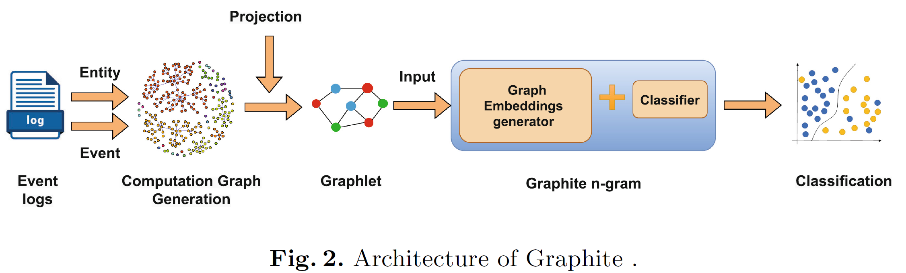
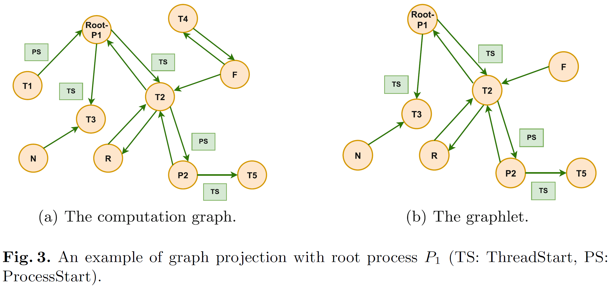

# Graphite: Real-Time Graph-Based Detection of Fileless Malware Attacks

Graphite is a graph-based malware-detection workflow built on Event Tracing for Windows (ETW) logs.

This repository is a public-facing artifact of the broader Graphite pipeline. It includes the original Graphite N-gram modeling code together with cleaned upstream ETW-to-graph processing stages that show the larger system behind the method.

Graphite transforms ETW telemetry into computation graphs, projects smaller graphlets from those graphs, and performs malware detection using thread-centered graph-based features.



## What is in this repository

This repository contains four main parts:

- `src/`: the original Graphite N-gram modeling and evaluation code
- `pipeline/`: cleaned ETW-to-graph processing stages
- `infra/logstash/`: a sanitized example of the ingestion layer used before graph construction
- `dataset/`: train/test data used by the current modeling path

The `pipeline/` directory is included to show the broader workflow behind Graphite rather than only the final classifier.

## Repository structure

```text
.
├── src/
│   ├── main.py
│   ├── graphite_n_gram.py
│   ├── dataprocessor_graphs.py
│   ├── parameter_parser.py
│   └── README.md
├── dataset/
│   ├── train/
│   └── test/
├── pipeline/
│   ├── step1_etl/
│   │   ├── format_elasticsearch_logs.py
│   │   ├── flatten_event_record.py
│   │   ├── field_selection.py
│   │   ├── text_event_parser.py
│   │   └── README.md
│   ├── step2_graph_generation/
│   │   ├── run_step2_pipeline.py
│   │   ├── build_computation_graph.py
│   │   ├── normalize_edge_directions.py
│   │   ├── encode_graph_attributes.py
│   │   ├── project_graphlets.py
│   │   ├── README.md
│   │   └── resources/
│   └── step3_processing_split/
│       ├── run_step3_pipeline.py
│       ├── process_graph_data.py
│       ├── split_dataset.py
│       └── README.md
├── infra/
│   └── logstash/
│       ├── logstash_pipeline_example.conf
│       └── README.md
├── docs/
│   └── figures/
│       ├── graphite_architecture_readme.png
│       ├── graphite_projection_readme.png
│       └── graphite_thread_embedding_readme.png
├── requirements.txt
└── README.md
```

## Pipeline overview

At a high level, Graphite follows this workflow:

1. parse and normalize ETW event records
2. build a computation graph over system entities and event relationships
3. project smaller graphlets from large graphs
4. convert graph artifacts into model-ready samples
5. train and evaluate Graphite N-gram models

The most important public pipeline stage in this repository is `pipeline/step2_graph_generation/`, which contains the graph construction and graphlet projection logic.



## Quick start

The simplest runnable path in this repository is the original Graphite N-gram modeling code under `src/`.

Train and test using the data under `dataset/train` and `dataset/test`:

```bash
python3 src/main.py
```

Change the N-gram size:

```bash
python3 src/main.py --N 2
```

Change the pooling method:

```bash
python3 src/main.py --pool mean
```

## Notes on scope

This repository is intended as a clean public research artifact and engineering snapshot.

Included:
- Graphite N-gram modeling code
- cleaned ETW-to-graph pipeline stages
- sanitized ingestion example
- representative documentation figures

Some raw datasets and environment-specific configuration are intentionally omitted from the public release.

For step-specific details, see the README files under `src/`, `pipeline/`, and `infra/logstash/`.


## How to Cite

If you use this code or dataset in your research, please cite our paper:

**Graphite: Real-Time Graph-Based Detection of Windows Fileless Malware Attacks**  
Priti Wakodikar*, Joon-Young Gwak*, Meng Wang, Guanhua Yan, Xiaokui Shu, Scott Stoller, Ping Yang  
*Co-first authors*

SecureComm 2024, LNICST 629, Springer, 2026  
DOI: [10.1007/978-3-031-94455-0_8](https://doi.org/10.1007/978-3-031-94455-0_8)

```bibtex
@inproceedings{wakodikar2024graphite,
  title={Graphite: Real-Time Graph-Based Detection of Windows Fileless Malware Attacks},
  author={Wakodikar, Priti and Gwak, Joon-Young and Wang, Meng and Yan, Guanhua and Shu, Xiaokui and Stoller, Scott and Yang, Ping},
  booktitle={SecureComm 2024},
  series={LNICST},
  volume={629},
  year={2026},
  publisher={Springer},
  doi={10.1007/978-3-031-94455-0_8}
}
