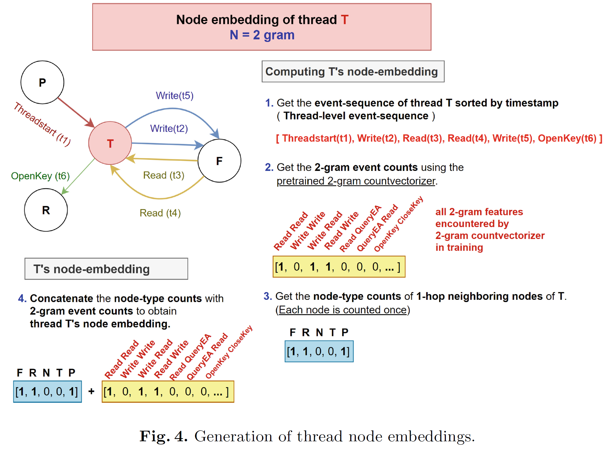

# Graphite modeling path (`src/`)

This directory contains the original Graphite N-gram modeling and evaluation code.

It takes processed graph artifacts, builds thread-centered graph embeddings, and performs malware classification using the Graphite N-gram pipeline.

## Key files

- `main.py`: entry point for training and evaluation
- `graphite_n_gram.py`: Graphite N-gram model and graph-embedding generation
- `dataprocessor_graphs.py`: loads processed graph samples into PyG data objects
- `parameter_parser.py`: command-line arguments

## Modeling idea

For each thread node, Graphite builds a thread-level representation by combining:
- N-gram counts from the thread’s timestamp-sorted event sequence
- counts of neighboring node types

Thread-level embeddings are then pooled into a graph-level embedding and passed to the downstream classifier.